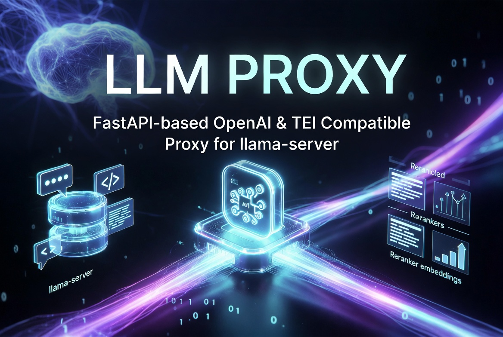

# BLProxy - Backend Locking Proxy

A declarative backend proxy with global locking. Routes requests to configured backends and manages cross-backend resource locks.



## Purpose

BLProxy solves the common problem of having **separate backends** for different AI capabilities:

- One llama-server for chat & completions (router mode)
- One dedicated server for embeddings
- One server for reranking (TEI-compatible)
- Optional STT / TTS backends
- Any custom HTTP services that need resource coordination

Instead of clients talking to many different ports, BLProxy offers a single endpoint with transparent request forwarding and **global locking** to prevent resource contention.

## Key Features

- **Declarative Backend Configuration**: Define backends in YAML with paths and locks
- **Global Locking**: Backends can lock other backends while processing
- **Connection Pooling**: Shared httpx client for efficient connections
- **Streaming Support**: SSE and regular responses streamed without buffering
- **Timeout Handling**: Configurable lock timeouts with 503 + Retry-After
- **Hop-by-Hop Header Filtering**: Proper HTTP proxy behavior
- **Error Propagation**: Backend errors (4xx, 5xx) forwarded correctly

## Architecture

```
                     ┌─────────────────────────────┐
                     │         BLProxy              │
                     │   (FastAPI on :4001)        │
                     └──────────────┬──────────────┘
                                    │
          ┌─────────────────────────┼─────────────────────────┐
          │                         │                         │
          ▼                         ▼                         ▼
   ┌──────────────┐        ┌────────────────┐        ┌──────────────┐
   │  LLM Server  │        │ Embeddings     │        │ Reranker     │
   │  (llama.cpp) │        │ Server         │        │ Server       │
   │   :8080      │        │   :8081        │        │   :8082      │
   └──────────────┘        └────────────────┘        └──────────────┘
   /v1/chat/*             /v1/embeddings           /v1/rerank
   locks: [embed]         locks: [llm]             locks: [llm, embed]
```

## Quick Start

```bash
cd /src/blproxy
uv sync

# Edit config.yaml or use your own
uv run python -m src.blproxy.main -c /path/to/config.yaml
```

## Configuration

All configuration is done through YAML:

```yaml
server:
  host: 0.0.0.0
  port: 4001

# Global lock settings
global_lock:
  enabled: true
  timeout: 300  # seconds to wait for locks

backends:
  llm:
    url: http://127.0.0.1:8080
    paths:
      - /v1/chat/completions
      - /v1/completions
      - /v1/models
    locks:
      - embed
      - rerank

  embed:
    url: http://127.0.0.1:8081
    paths:
      - /v1/embeddings
    locks:
      - llm

  rerank:
    url: http://127.0.0.1:8082
    paths:
      - /v1/rerank
      - /rerank
    locks:
      - llm
      - embed
```

### Backend Configuration

Each backend specifies:

- `url`: Backend server URL
- `paths`: List of path patterns (supports wildcards like `/v1/vision/*`)
- `locks`: List of other backend names to lock while processing

### Global Lock Settings

- `enabled`: Whether locking is active
- `timeout`: Seconds to wait for locks (returns 503 if exceeded)

## How Locking Works

1. When a request arrives, BLProxy finds the matching backend
2. If the backend has `locks` configured, BLProxy acquires those locks
3. If locks are held by another backend, BLProxy waits up to `timeout` seconds
4. Request is forwarded to the backend
5. Locks are released after response is complete

**Example**: If `llm` locks `embed`, and an LLM request is processing, all embedding requests will wait until the LLM request completes.

## Response Handling

- **SSE (Server-Sent Events)**: Streamed line-by-line for chat completions
- **Regular responses**: Streamed byte-by-byte to avoid buffering
- **Timeouts**: Configurable (300s default, 30s connect)
- **Errors**: Backend HTTP status codes forwarded (400, 429, 500, 504, etc.)

## Testing

```bash
uv run pytest tests/ -v
```

All tests use mocked backends - no real servers required.

## Deployment (systemd)

Create a service file:

```ini
[Unit]
Description=BLProxy - Backend Locking Proxy
After=network.target

[Service]
Type=simple
User=noname
WorkingDirectory=/src/blproxy
ExecStart=/src/blproxy/.venv/bin/python -m src.blproxy.main -c /src/blproxy/config.yaml
Restart=always

[Install]
WantedBy=multi-user.target
```

## Design Philosophy

- **Transparency**: BLProxy tries to be invisible - status codes and streaming preserved
- **Declarative**: All configuration in YAML, no code changes needed
- **Efficient**: Connection pooling and streaming to minimize resource usage
- **Robust**: Proper timeout handling and error propagation

## License

Apache License 2.0

---

**BLProxy** - One clean API in front of many specialized AI backends with global resource locking.
